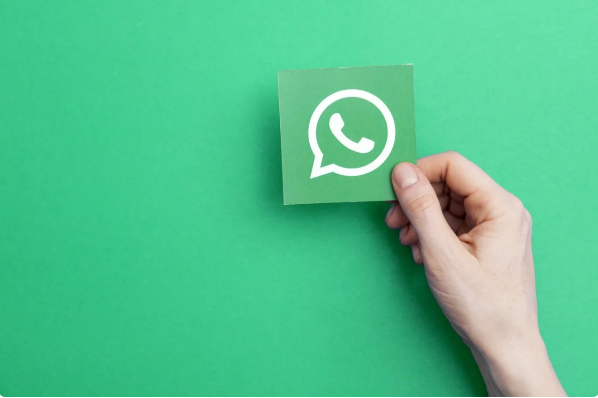

# How to write a WhatsApp chatbot for free
^^September 10, 2020^^

Here we will consider what options there are for writing a chatbot for the WhatsApp messenger, compare the options, and also discuss how to write and use a WhatsApp chatbot for free.

Nowadays, the issue of developing WhatsApp chatbots is of current interest. WhatsApp chatbots are widespread and in good demand. Businesses are ready to pay for the development of chatbots because, on the one hand, chatbots reduce costs by automating some of the everyday processes; on the other hand, chatbots significantly contribute to increasing sales, because they allow you to retain customers, as well as let you return your lost customers.

It’s obvious that to write a WhatsApp chatbot, you need a gateway, a messenger API. Not that long ago, Facebook released its official gateway - [WhatsApp Business API](https://developers.facebook.com/docs/whatsapp/). However, not everyone can access the WhatsApp Business API gateway. Access to the WhatsApp Business API is available only via official Facebook partners published on the company's [website](https://www.facebook.com/business/partner-directory/search?platforms=whatsapp&solution_type=messaging&ref=wa2019t1).

## WhatsApp Business API limitations

1. You must have a legal entity, such as an LLC, or to be an individual entrepreneur, to use the WhatsApp Business API.
2. You have to pay a monthly subscription fee of about 30.000 RUR/month.
3. You have to go through a long bureaucratic procedure for approval of the company’s account with Facebook – for about 3-4 weeks.
4. You can’t send whatever you want first, but only a template message, which is also to be pre-agreed with Facebook.
5. You have to pay for each outgoing template message apart at a price of approximately 4 RUR per message.

The above limitations ``shut the door`` on the use of the official WhatsApp Business API gateway for writing chatbots by individual programmers and startuppers. A programmer, as a rule, does not have his own legal entity, moreover he doesn’t’ even have an opportunity to pay a subscription fee of ``30.000 RUR/month``. And if one calculates the cost of sending each template message, then the total cost will be for about ``50.000 RUR/month`` at an average chatbot load. Such costs are beyond means for startuppers and entry-level programmers.

## What are alternatives to WhatsApp Business API

You can surf github for various WhatsApp API implementations. But one of the disadvantages of this solution is that you would have to see into maze of the code, which isn’t actually relates to the chatbot. Besides, you would have to pay for hosting in order for the WhatsApp API module to be available via the Internet and work.

You are also to understand that Facebook constantly makes modifications to WhatsApp, so the libraries from github stop working over time. There is a certain period of time - a day or two, during which the library will be out of service. In other words, your chatbot will not work until the author of the code releases a new patch on github. And such updates fall out three or four times a year and they are usually unexpected. So you have to look forward to the patch for a few days. And what if the patch isn’t released ?

A worthy solution would be to use the GREEN-API service to access the stable and fast WhatsApp API. Our service offers ``a free tariff for developers``. You can write your chatbot for as long as you wish and still not pay a penny. And when the chatbot is ready, you may sell it to a client, and it will be the client who will pay.

Both of the above ways to use the WhatsApp API are unofficial. In other words, Facebook does not approve of such use of its product and combats this sort services and implementations.

## What are the risks when using the unofficial WhatsApp API gateway 

``The only risk`` is that the WhatAsApp account will be blocked without the opportunity to recover. In this case, the phone number will remain. It will still be possible to make calls and send SMS, at the same time, to use WhatsApp on this number will be impossible.

However, if you write a chatbot, then all risks are withdrawn. The client writes first to the bot. Thus, he indirectly agrees to enter into a dialogue with the bot. If the client writes to you first, then you will never get banned. You may also write first on your part, but, of course, within reasonable limits.

For the entire period of work, starting from 2017, we have ``not had a single ban``, as the service is used mainly for chatbots and for integration with various CRMs (1C, Bitrix24, amoCRM, etc.). Besides our service has a mechanism for protecting the number against a ban. You can be sure that your number will never be blocked. The system will stop sending messages and send a notification (webhook) at the first sign of a potential ban.

## Summing up

Only major IT companies that work with large customers, for which the average check for a chatbot of ``50.000 RUR/month`` is not an issue can afford writing chatbots on the official WhatsApp Business API. Small and medium businesses could solve the problem by using an unofficial WhatsApp API with the risk of account blocking, but at a price ten times lower. As the business begins to understand the effectiveness of the chatbot, one may talk about moving from an unofficial channel to an official one. 
Definitely, for individual developers and startup teams, the best solution is to use unofficial WhatsApp API providers, especially since the risks of number blocking in our GREEN-API service are entirely excluded.
