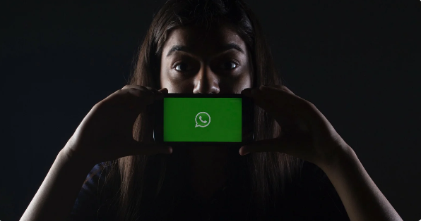

# Сравниваем Green API и официальный API
^^17 сентября 2020 г.^^

Как бесплатно подключить мессенджер WhatsApp к вашей учетной системе и начать отправлять сообщения своим клиентам, какие существуют варианты интеграции с мессенджером, преимущества и недостатки каждого варианта рассмотрим далее в этой статье.

Популярность мессенджера WhatsApp растет, а вместе с ней возрастает потребность коммуникаций бизнеса со своими клиентами. Ранее мы уже рассматривали как использовать WhatsApp для реализации [чат-ботов](kak-besplatno-napisat-chatbota-whatsapp.md). В этой статье рассмотрим какие существуют способы интеграции с мессенджером, их преимущества и недостатки.

Ваша компания растет и отправлять сообщения каждому клиенту вручную становится накладно. Вы уже используете CRM для автоматизации части своих процессов, например "1С", однако по-прежнему взаимодействуете со своими клиентами в ручном режиме. Ручной режим, с одной стороны, отнимает немало времени, а с другой, не позволяет систематизировать и сохранять переписку с каждым клиентом в привязке к услуге, заказу, товару. Со временем, в бесконечном море чатов становится трудно ориентироваться.

Правильным решением будет выполнить интеграцию вашей учетной системы с мессенджером WhatsApp. После настройки интеграции вся переписка с клиентами будет доступна из программы, будет упорядочена, и каждый диалог будет привязан к договору, товару, заказу. Появится возможность отправлять информационные рассылки клиентам прямо из базы в автоматическом режиме.

## Как настроить интеграцию с WhatsApp?

На данный момент существует два способа выполнить интеграцию с мессенджером: ``официальный`` способ и ``неофициальный``. Плюсы и минусы каждого способа рассмотрим далее. Вопрос сравнения официального и неофициального WhatsApp был также рассмотрен нами ранее в статье [Как бесплатно написать чат-бота WhatsApp](kak-besplatno-napisat-chatbota-whatsapp.md).

## WhatsApp Business API (официальный способ интеграции)

В 2019 году корпорация Facebook опубликовала [WhatsApp Business API](https://developers.facebook.com/docs/whatsapp/) для интеграции со своим мессенджером. Однако подключиться к шлюзу напрямую нельзя, а только через посредников. Список официальных партеров Facebook опубликован на [сайте компании](https://www.facebook.com/business/partner-directory/search?platforms=whatsapp&solution_type=messaging&ref=wa2019t1). Для подключения потребуется оплачивать ежемесячную абонентскую плату, дополнительно оплачивать каждое исходящее сообщение по шаблону, пройти бюрократическую процедуру согласования порядка 2 мес. Дополнительным важным ограничением является запрет на отправку произвольного сообщения. Разрешено отправлять только заранее согласованное шаблонное сообщение. В шаблонных сообщениях нельзя указывать рекламу и использовать их для продвижения. Однако к преимуществам официального канала WhatsApp можно отнести высокую скорость отправки и получения сообщений, неограниченное количество сообщений в сутки, снятие всех рисков блокировки аккаунта, а также возможность бесплатно вести переписку с клиентом в течение 24х часов с момента последнего входящего сообщения от клиента.

## Green-API (неофициальный способ интеграции)

До появления официального шлюза WhatsApp Business API бизнес остро нуждался в интеграции с мессенджером. Поэтому на свет и появился сервис [Green-API](https://green-api.com/). Сервис позволяет выполнить интеграцию с WhatsApp и поддерживает все сценарии, которые предусмотрены в официальном канале и даже много больше этих сценариев. Главным преимуществом [Green-API](https://green-api.com/) является полное снятие всех ограничений:

* можно писать первым любое сообщение, и забыть про шаблоны
* абонентская плата в 30 раз ниже, чем у официального канала
* сообщения не тарифицируются, поэтому вам не придется дополнительно что-то оплачивать сверх абонентской платы
* отсутствует долгая бюрократическая процедура согласования аккаунта
* можно выполнять информационные и рекламные рассылки по своей базе клиентов

Однако использование неофициального шлюза имеет и свои недостатки. Поскольку шлюз неофициальный, то всегда существует риск потерять возможность использовать WhatsApp на вашем номере – иными словами словить бан. Номер телефона можно будет по-прежнему использовать для звонков и отправки SMS, однако использовать номер в приложении WhatsApp будет невозможно, он будет заблокирован.

Для любого бизнеса потеря связи со своими клиентами через WhatsApp является недопустимой, поэтому, мы разработали в сервисе систему различных фильтров, которые предохраняют ваш номер от блокировки. [Green-API](https://green-api.com/) не позволит выполнить действия, которые могут привести к риску блокировки. При первых признаках вероятности блокировки система приостановит отправку сообщений и уведомит вашу систему (отправит вебхук).

Следует отметить, что за все время работы, начиная с 2017 года, у нас не было ``ни одной блокировки`` номера клиента!

Вышесказанное можно обобщить тезисно:

### WhatsApp Business API

* Отправлять первым можно ``только по шаблону``
* Цена каждого исходящего сообщения по шаблону около ``4 руб``
* Отправлять сообщения бесплатно разрешено только в ``течение 24х часов`` с момента крайнего входящего сообщения от клиента
* Нельзя отправлять ``маркетинговые`` сообщения даже за плату
* Цена подписки около ``30к руб/мес``
* Итоговая цена с учетом трафика около ``80к руб/мес``
* Оформление документов и подключение ``2 месяца``
* ``Безлимитное`` количество сообщений в сутки
* Вероятность бана ``отсутствует``

### Green-API

* Можно отправлять первым ``любое сообщение``
* Все исходящие сообщения ``бесплатные``
* Можно отправлять ``маркетинговые`` сообщения
* Цена подписки ``1к руб/мес``
* Итоговая цена с учетом трафика ``1к руб/мес``
* Подключение ``за 1 минуту``
* Не более ``5000`` сообщений в сутки
* Вероятность бана ``отсутствует``, за счет системы умных ``фильтров``

## Выводы

Официальный канал WhatsApp Business API хорош и скоростью отправки/приёма сообщений, и безлимитным количеством сообщений в сутки, и красивым названием, и статусом, однако позволить его себе могут далеко не все. Из сравнительного анализа видно, что стоимость обслуживания официального канала суммарно обойдется организации порядка ``80.000 руб/мес``. При этом не будет возможности отправлять своим клиентам маркетинговую информацию. Иными словами, официальный канал WhatsApp использовать для продвижения своих услуг и увеличения продаж не получиться, даже за ``80.000 руб/мес``. Поэтому для небольших организаций, у которых каждый рубль на счету, отличным решением будет использовать сервис Green-API. За абонентскую плату ``690 руб/мес`` вы получаете возможность интегрировать сервисы своей компании с мессенджером WhatsApp, а наша система заботится о стабильности и безопасности интеграции и ``защищает ваш номер`` от блокировки.
